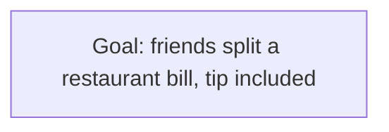

# MINDMAP — bill-splitting page

Form: rule 9.2. Updated within the WORK UNIT in which a node appears.

- Goal: friends split a restaurant bill, tip included
  - (CRITERIA are added at S4)

```mermaid
graph TD
  GOAL[Goal: friends split a restaurant bill, tip included]
```
